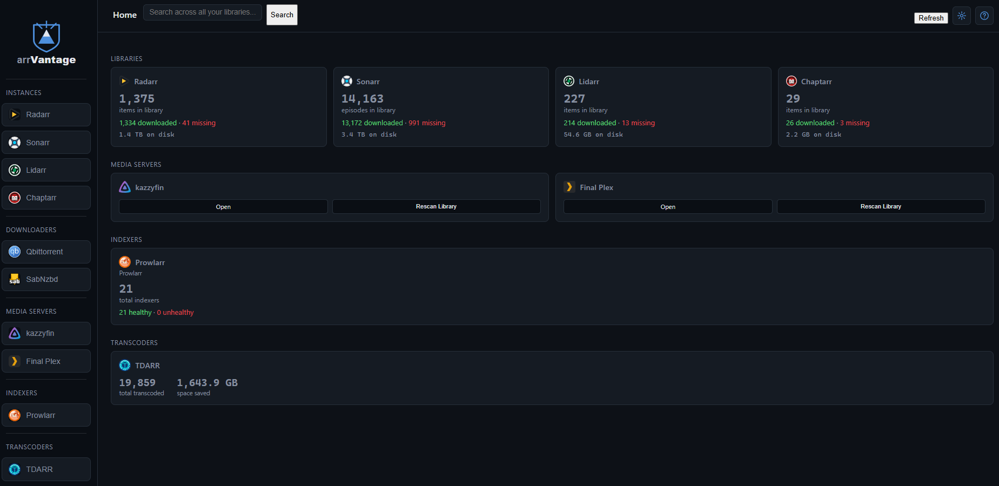

# arrVantage

> A unified web frontend for your media automation stack — arr apps, indexers, Seerr, media servers, metadata providers, and transcoders, all in one place.

<!-- TODO: screenshot or GIF of the dashboard goes here. This is the single highest-value addition — README traffic mostly bounces at "no picture." -->
<!--  -->

<!-- TODO: badges, once you have them — e.g. license, latest image tag, GHCR pulls -->
<!--   -->

## Status

Actively developed — expect rough edges and breaking changes between releases. Pin a specific image tag rather than tracking `latest` if you want stability.

## Features

- Unified dashboard for your \*arr stack (Sonarr, Radarr, Lidarr, Readarr (Tested with Bookshelf and then Chaptarr))
- Indexer visibility (Prowlarr)
- Request management via Seerr (Overseerr / Jellyseerr / Seerr)
- Media server status (Plex / Jellyfin / Emby)
- Metadata lookups (TMDB / TVDB / Fanart.tv)
- Transcode status (Tdarr)

## Getting Started

**Just want to run it?** Use the quick install below.

**Want to fork it, customize it, or build your own image?** See [SETUP.md](SETUP.md) for the full walkthrough — forking the repo, the automatic build pipeline, deployment on a generic Docker host or TrueNAS specifically, and a complete reference table of where to find every integration's API key.

## Installation

```bash
docker run -d \
  --name arrvantage \
  -p 5000:5000 \
  -v /path/to/config:/app/data \
  ghcr.io/kazwahs/arrvantage:latest
```

Or with `docker-compose.yml`:

```yaml
services:
  arrvantage:
    image: ghcr.io/kazwahs/arrvantage:latest
    pull_policy: always
    container_name: arrvantage
    ports:
      - "5000:5000"
    volumes:
      - /path/to/config:/app/data
    environment:
      - CONFIG_DIR=/app/data
      - FORCE_HTTPS_COOKIES=false
    restart: unless-stopped
```

Then open `http://<your-server>:5000` and connect your services (API URLs + keys) from the settings page. There is an initial setup wizard that will run for you to set up your admin account.

## Configuration

| Variable | Description | Default |
|---|---|---|
| `CONFIG_DIR` | Where `config.json` (instances, users, API keys) is read from and written to inside the container. Must point at your mounted volume, or settings won't survive a restart. | `/app/data` |
| `FORCE_HTTPS_COOKIES` | Set to `true` once your reverse proxy + SSL certificate are confirmed working end-to-end, to make the login cookie HTTPS-only. Leave `false` for plain local-network HTTP access. | `false` |

## Why arrVantage?

I run the full \*arr stack, Seerr, a media server, and a transcoder, and every time I needed to check on one I had a browser tab open for each. What started as a batch file that just launched all those tabs at once slowly turned into the idea for a proper unified frontend — one place to see and manage everything instead of tab-hopping between five different UIs.

## A Note on How This Was Built

I'm in my mid-40s, work more than full-time, and have a family — I don't have the spare hours to learn a new stack from scratch right now. So I built arrVantage with Claude's help rather than writing every line by hand. Full transparency on that: the architecture decisions, the debugging, and the ongoing maintenance are mine, but a lot of the code itself came out of that collaboration. It's working well for me, and I'd rather ship something useful than wait until I had time to do it "the traditional way."

It's still evolving — I'm actively using it myself and tweaking it as I go. Feel free to try it out, and open an issue if something breaks or you'd like to see a feature added.

## Supported Integrations

| Category | Supported |
|---|---|
| \*Arr apps | Radarr (movies), Sonarr (TV), Lidarr (music), Chaptarr / Readarr-style book managers |
| Indexers | Prowlarr — indexer health status, individual and bulk testing |
| Downloaders | qBittorrent, SABnzbd |
| Requests | Overseerr, Jellyseerr |
| Media servers | Plex, Jellyfin, Emby — Now Playing, Recently Added, Watch History, Users, library rescan |
| Activity data | Tautulli and/or Tracearr, for richer Now Playing / Watch History / Users than the media servers' own APIs provide alone |
| Metadata | TMDB, TVDB, Fanart.tv, TheAudioDB |
| Transcoding | Tdarr — stats overview, space saved, per-node worker/queue status |

## Roadmap

<!-- TODO -->

- [ ] ...

## Contributing / Feedback

Issues and feature requests are welcome — this is very much a living project. <!-- TODO: link to Issues, note if PRs are wanted -->

## License

Licensed under the [GNU General Public License v3.0](LICENSE) — the same license used by Sonarr, Radarr, and Prowlarr. In short: you're free to use, modify, and redistribute arrVantage, but any distributed modified version must also be open source under GPLv3.

## Acknowledgments

Built with the help of [Claude](https://claude.ai).